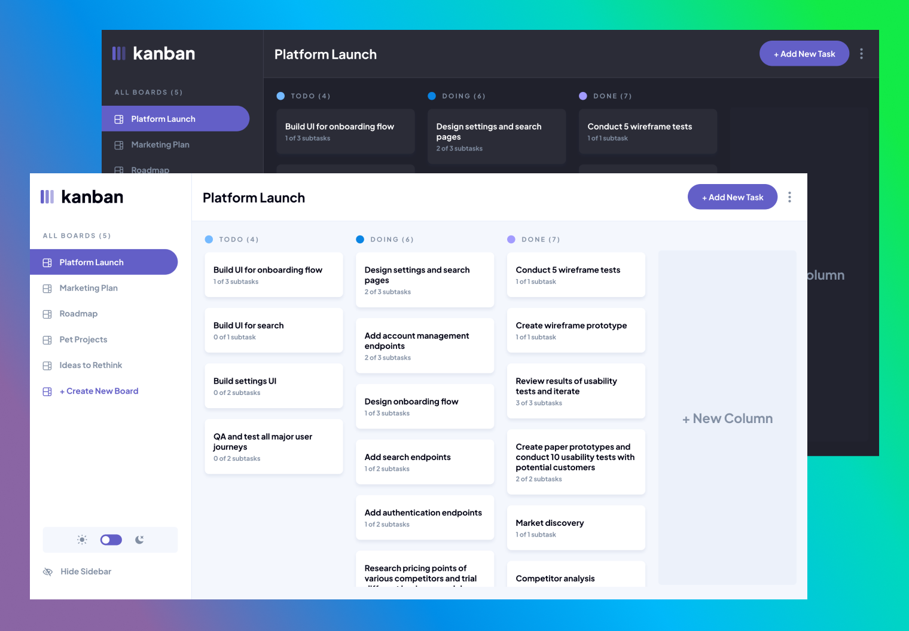

# Kanban Task Management Web App


### Description
This Kanban Task Management project is built with vuejs and uses localstorage for storing your task data and preferences.
Find this in action at the provided link below:

#### [Live Demo](https://kanban-task-management-by-towkir.netlify.app/)

### Features
These are the mentionable features:

- View the optimal layout for the app depending on the device's screen size.
- Create, read, update, and delete boards, columns, tasks and subtasks.
  - Deleting a Board will delete all columns, tasks and subtasks.
  - Deleting a Column will delete all tasks and subtasks.
  - Deleting a task will delete all subtasks.
  - User is warned about these actions that they cannot be reversed.
- Mark subtasks as complete/incomplete.
- Move tasks between columns via a dropdown or move and re-arrange them via drag and drop.
- Hide/show the board sidebar.
- Toggle the theme between light/dark modes.
- Changes are stored even after refreshing the browser (used `localStorage` to hydrate vuex).

#### About
Github Repo can be found [here](https://github.com/towkir/kanban-task-management-web-app) (if you're not already viewing this from github).


---

#### Project Setup Instructions

```
# Project setup
npm install

# Compiles and hot-reloads for development
npm run serve

# Compiles and minifies for production
npm run build

# Lints and fixes files
npm run lint
```

*Feel free to contribute, fix bugs, or provide feedback*
